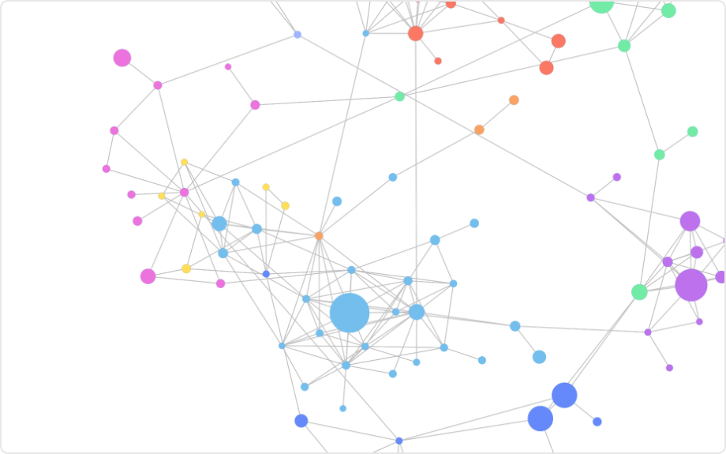

# Network Chart Mod for Spotfire®

Visualizes relationships and connections between data points. Useful for display of data, where multiple types of relationships exist, by providing an interactive and configurable network representation. To perform an in-depth analysis of relationships within the data, panning and zooming capabilities are available.

This network chart is a force-directed chart, which means it simulates forces between the network nodes to render a visually appealing and understandable representation of a network.

Network charts have many use cases. You can use them to analyze connections between people through online, social, and physical interactions, to detect fraud, to analyze products, trends, and impact in for example marketing and sales, to analyze processes and data correlation, and even to provide explainability in data science and machine learning models.

## Installation & Use

[Download latest version](https://github.com/spotfiresoftware/spotfire-mod-network/releases)

The [Wiki](https://github.com/spotfiresoftware/spotfire-mod-network/wiki) contains step-by-step instruction on how to install and use this Mod in Spotfire®.

## Building the Project

In a terminal window:
- `npm install`
- `npm start`

In a new terminal window:
- `npm run server`

## About Mods for Spotfire®
-   [Spotfire Community Exchange](https://community.spotfire.com/files/): A safe and trusted place to discover ready-to-use Mods
-   [Developer documentation](https://spotfiresoftware.github.io/spotfire-mods/docs/): Introduction and tutorials for Mods developers
-   [Mods examples](https://github.com/TIBCOSoftware/spotfire-mods/): A public repository for examples projects
